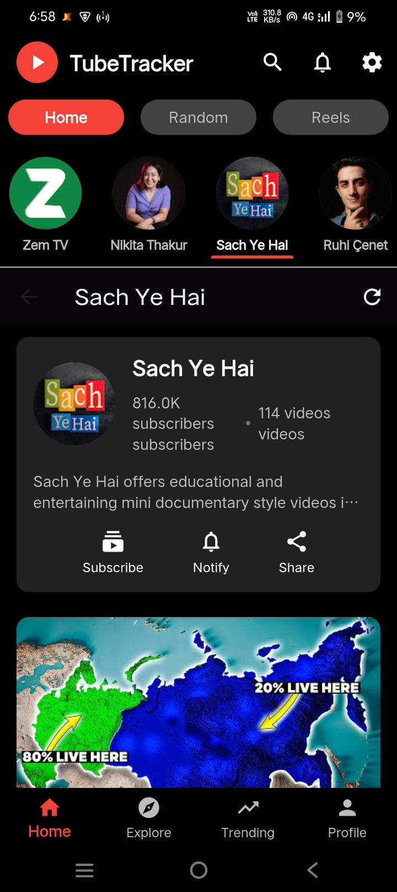
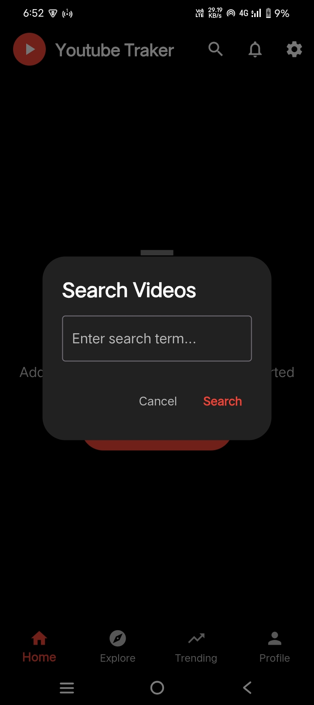

<div align="center">
  <h1>
    <br/>
    Flutter YouTube API App
  </h1>
  <h3>A Modern YouTube Video Browser with Advanced Features</h3>
</div>

<p align="center">
    <a href="https://github.com/jamalihassan0307/" target="_blank">
        
    </a>
    <a href="https://www.linkedin.com/in/jamalihassan0307/" target="_blank">
        
    </a>
</p>

## 📌 Overview

A feature-rich Flutter application that leverages the YouTube Data API to provide a seamless video browsing experience. The app includes video playback, channel management, and social features with a modern UI design.

## 🚀 Tech Stack

- **Flutter** (UI Framework)
- **GetX** (State Management)
- **Firebase Auth & Firestore** (Backend)
- **YouTube Data API**
- **Provider** (Additional State Management)
- **Custom Animations**

## 🔑 Key Features

- ✅ **Video Playback**: Seamless YouTube video integration
- ✅ **Channel Management**: Subscribe and manage YouTube channels
- ✅ **Search**: Search videos and channels
- ✅ **Trending Videos**: Browse trending content
- ✅ **Comments**: View and interact with video comments
- ✅ **Reels**: Short-form video content
- ✅ **User Authentication**: Secure login system
- ✅ **Responsive Design**: Works on all screen sizes
- ✅ **Caching System**: Efficient data management
- ✅ **API Key Rotation**: Smart API quota management

## 📸 Banner


## 📸 Screenshots

### Core Features

<table border="1">
  <tr>
    <td align="center">
      
      <p><b>Splash Screen</b></p>
    </td>
    <td align="center">
      
      <p><b>Login Screen</b></p>
    </td>
    <td align="center">
      
      <p><b>Profile Screen</b></p>
    </td>
  </tr>
</table>

### Home & Video Features

<table border="1">
  <tr>
    <td align="center">
      
      <p><b>Home Screen</b></p>
    </td>
    <td align="center">
      
      <p><b>Home Feed View 1</b></p>
    </td>
    <td align="center">
      
      <p><b>Home Feed View 2</b></p>
    </td>
  </tr>
  <tr>
    <td align="center">
      
      <p><b>Home Feed View 3</b></p>
    </td>
    <td align="center">
      
      <p><b>Home Feed View 4</b></p>
    </td>
    <td align="center">
      
      <p><b>Video Player</b></p>
    </td>
  </tr>
</table>

### Search & Explore

<table border="1">
  <tr>
    <td align="center">
      
      <p><b>Video Search</b></p>
    </td>
    <td align="center">
      
      <p><b>Channel Search</b></p>
    </td>
    <td align="center">
      
      <p><b>Explore Section</b></p>
    </td>
  </tr>
  <tr>
    <td align="center">
      
      <p><b>Trending Videos</b></p>
    </td>
    <td align="center">
      
      <p><b>Random Videos</b></p>
    </td>
    <td align="center">
      
      <p><b>Video Reels</b></p>
    </td>
  </tr>
</table>

### Channel Features

<table border="1">
  <tr>
    <td align="center">
      
      <p><b>Channel List</b></p>
    </td>
    <td align="center">
      
      <p><b>Channel View 1</b></p>
    </td>
    <td align="center">
      
      <p><b>Channel View 2</b></p>
    </td>
  </tr>
  <tr>
    <td align="center">
      
      <p><b>Channel Videos</b></p>
    </td>
    <td align="center">
      
      <p><b>No Channel Found</b></p>
    </td>
  </tr>
</table>

### Video Interaction

<table border="1">
  <tr>
    <td align="center">
      
      <p><b>Video Comments</b></p>
    </td>
    <td align="center">
      
      <p><b>Comments Section</b></p>
    </td>
    <td align="center">
      
      <p><b>Video Description</b></p>
    </td>
  </tr>
</table>

## 📁 Project Structure


```
lib/
├── main.dart
├── controller/
│   └── YouController.dart
├── models/
│   ├── channel_model.dart
│   └── video_model.dart
├── pages/
│   ├── All.dart
│   ├── login_screen.dart
│   ├── reels_page.dart
│   ├── video_screen.dart
│   └── youtube_home.dart
├── services/
│   ├── api_service.dart
│   └── staticdata.dart
└── widgets/
    └── [Various widget files]
```

## 📱 Download APK

You can download the latest version of the app from:
[APK/app-release.apk](APK/app-release.apk)

## 🔧 API Setup

The application uses the YouTube Data API v3. It implements an API key rotation system to manage quotas effectively. To set up your own API keys:

1. Get API keys from Google Cloud Console
2. Add them to the `_apiKeys` list in `api_service.dart`
3. Configure Firebase credentials

## 👤 Demo User Account

For testing purposes, you can use the following demo account:

**Email:** `jamalihassan0307@gmail.com`  
**Password:** `123456@`

## 📞 Contact Information

For further details, support, or collaboration:

- **WhatsApp:** +92 307 3921189
- **Email:** jamalihassan0307@gmail.com
- **Academic Email:** f22bd0cs1e02011@iub.edu.pk

## �� Advanced Features

- **Smart Caching**: Implements a 15-minute cache system to reduce API calls
- **API Key Rotation**: Automatically rotates through multiple API keys
- **Infinite Scrolling**: Load more content as user scrolls
- **Rich Video Details**: View counts, likes, and comment management
- **Channel Subscription**: Subscribe/unsubscribe from channels
- **Video Categories**: Browse videos by different categories

## 👨‍💻 Developer

Developed by [Jam Ali Hassan](https://github.com/jamalihassan0307)

---

<p align="center">
  Made with ❤️ using Flutter
</p>